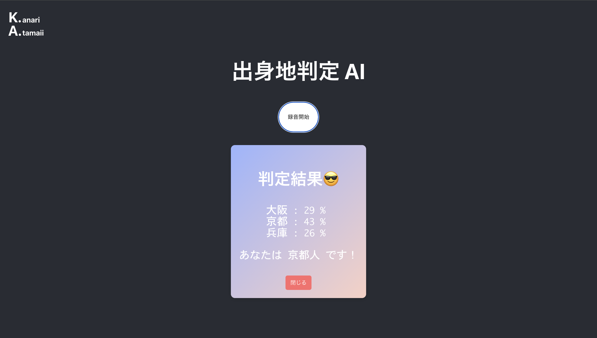

# K.A. (かなりあたまのいい) 日本の出身地判定AI

## チーム名
チーム25 HackSphere

## 背景・課題・解決されること

<!-- テーマ「関西をいい感じに」に対して、考案するプロダクトがどういった(Why)背景から思いついたのか、どのよう(What)な課題があり、どのよう(How)に解決するのかを入力してください -->

関東の方とお話ししているとよく「関西の方ですか？」と聞かれますが、それは関西弁が特徴的な話し方だからであると思います。\
そんな特徴的な話し方の関西弁にも、実は地域によって訛りの違いがあります。\
その聞き分けることの難しい違いをAIに分析してもらうことで、自分はどのような訛りの傾向があるのかを知ることができます。

## プロダクト説明

K. : かなり \
A. : あたまのいい \
N. : 日本の \
S. : 出身地判定 \
A.I : AI

です。よろしくおねがいします。

## 操作説明・デモ動画
[デモ動画はこちら](./demo_movie.mov)
<!-- 開発したプロダクトの操作説明について入力してください。また、操作説明デモ動画があれば、埋め込みやリンクを記載してください -->

1. コンテナを起動
    - ターミナルで `source run_container.sh` を実行
    - コンテナが起動してアタッチされる
2. サーバーの起動
    - コンテナに接続したターミナルで `source run_servers.sh` を実行
3. アプリケーションに接続
    - ブラウザで `http://localhost:3000` を開く
4. 声を録音する
    - 『録音開始』ボタンを押して、表示される文章を読み上げる
    - 『送信』ボタンを押すと、録音が停止して音声がバックエンドサーバーに送信される
5. 分析結果が表示される

## 注力したポイント

### アイデア面

K.A.N.S.A.Iというお題から、K.（かなり） A.（あたまのいい） N.（日本の） S.（出身地判定） A.I（AI）という名前のAIを連想しました。\
入力された音声に対して、話者の話し方の特徴をAIが分析して出身地を特定するAIです。

### デザイン面

左上にある、K.anari A.tamanoiiといったロゴや、音声入力中に周期的に動くボタン、結果発表の際のランダムに表示される顔文字など、ところどころデザインに遊び心を入れました。

### その他

## 使用技術

- データの前処理
    1. 音声のサンプリングレートを16000に変換する
    2. 波形の振幅を標準化する
    3. OpenAI whisper の文字起こしを用いて、沈黙部分を削る

- 特徴量抽出（HuBERT）
    1. 音声データを５秒間隔でN個に区切る
    2. HuBERTの事前学習済みモデルに入力して、N $\times$ T 本の特徴量ベクトルを得る
    - （T は５秒の音声をHuBERTがトークン分けした数）

- 分類（SVM）
    1. HuBERTで抽出した特徴量ベクトルを学習データとして、SVMをscikit-learnを用いて学習
    2. 重みをtorch.Linearに移植して、推論する
    3. 結果にsoftmaxをかけて、確率分布とする

## 参照

アプリケーションの作成にあたって、学習用データと、事前学習済みのHuBERTモデルに以下のものを使用しました。

- 学習用データ
    - [JTubeSpeech-ASV](https://sites.google.com/site/shinnosuketakamichi/research-topics/jtubespeech-asv_corpus)
    - [方言録音資料シリーズ](https://mmsrv.ninjal.ac.jp/hogenrokuon_siryo/?utm_source=chatgpt.com)

- 事前学習済みモデル
    - [rinna/japanese-hubert-base](https://huggingface.co/rinna/japanese-hubert-base)